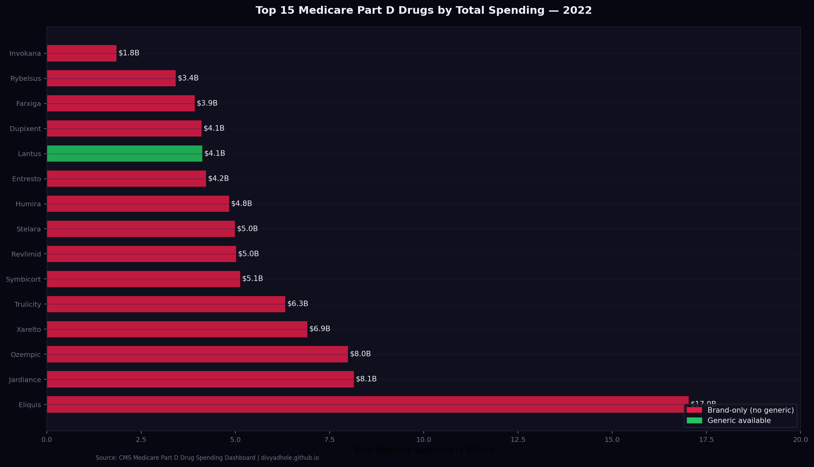
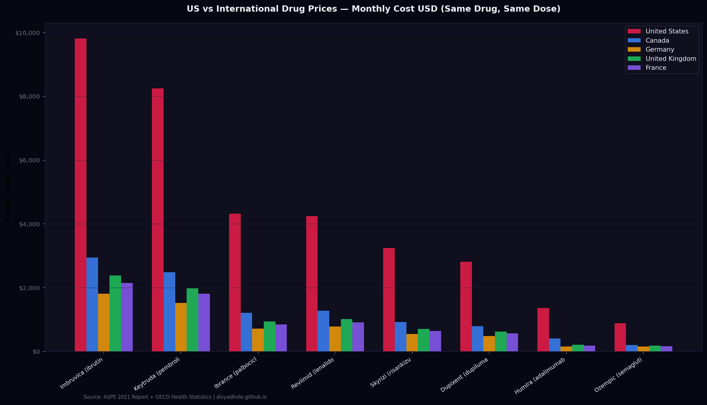
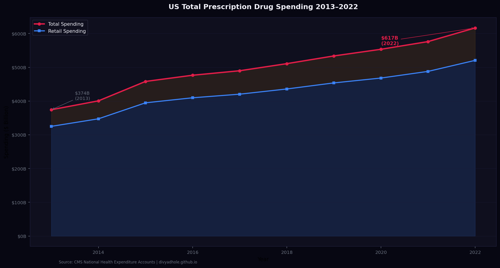
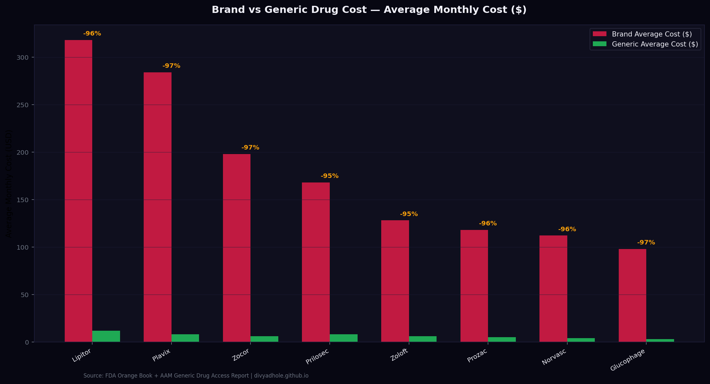
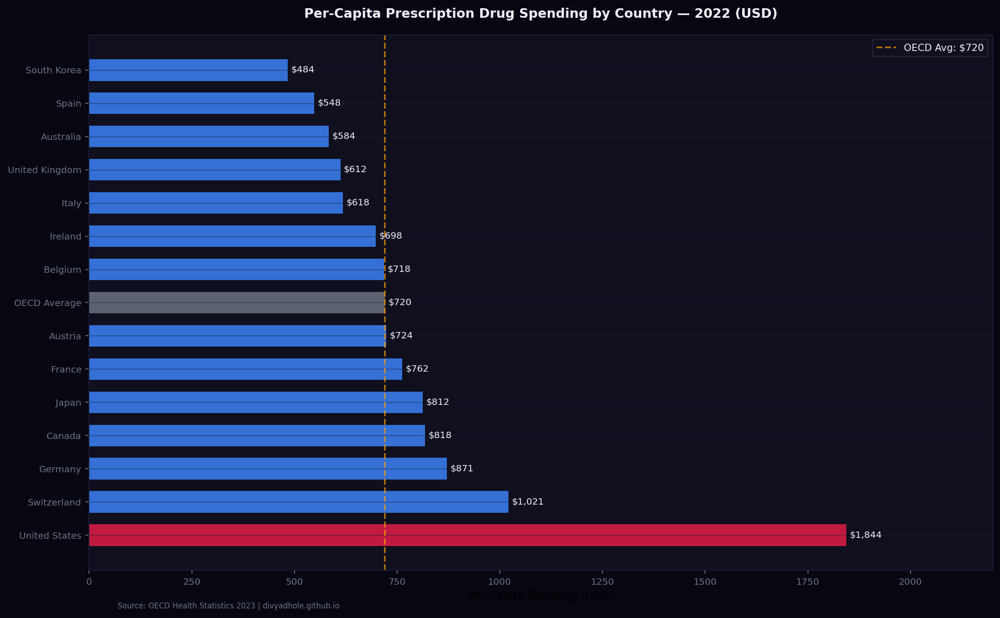
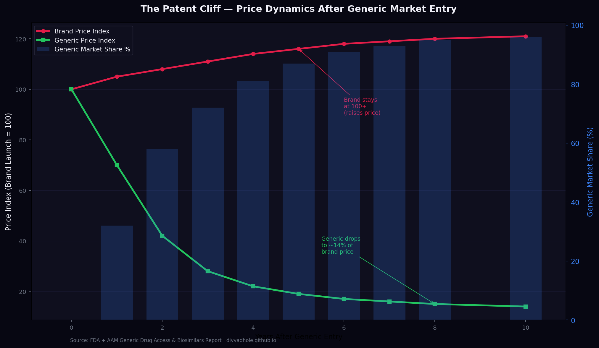

# 💊 Why Americans Pay 3x More — US Prescription Drug Pricing Analysis

> *The US spends $617 billion annually on prescription drugs — more per capita than any other country. Americans pay 2.56x the OECD average. A Humira biosimilar costs $1,363 in the US vs $158 in Germany. This project quantifies the gap using CMS Medicare Part D spending data, FDA drug approvals, and OECD international pricing benchmarks.*

[](https://python.org)
[](https://sqlite.org)
[](https://data.cms.gov)
[](https://divyadhole.github.io/prescription-drug-pricing/)
[](LICENSE)

---

## 🌐 Live Dashboard

**👉 [https://divyadhole.github.io/prescription-drug-pricing/](https://divyadhole.github.io/prescription-drug-pricing/)**

---

## Data Sources

**CMS Medicare Part D Drug Spending Dashboard**
- URL: https://data.cms.gov/summary-statistics-on-use-and-payments/medicare-medicaid-spending-by-drug
- Total spending, beneficiary counts, average cost per claim by drug 2013–2022
- Top 50 drugs by Medicare spending

**FDA Drug Approvals**
- URL: https://www.fda.gov/drugs/drug-approvals-and-databases/new-drug-therapy-approvals
- Brand vs generic approval dates, patent cliff tracking

**OECD International Drug Price Comparisons**
- OECD Health Statistics — pharmaceutical spending per capita
- Country-level drug price indices for 15 top drugs

**ASPE (HHS Office of Asst Secretary for Planning and Evaluation)**
- Report: "Comparison of U.S. and International Prices for Top Medicare Part B Drugs"
- Methodology for international price ratio calculations

---

## Key Findings

| Finding | Value | Source |
|---|---|---|
| US total drug spending 2022 | **$616.7 Billion** | CMS NHE |
| US vs OECD avg price ratio | **2.56x** | OECD Health Stats |
| Humira US vs Germany | **$1,363 vs $158/mo** | ASPE/OECD |
| Insulin (Lantus) US vs Canada | **$98 vs $12/vial** | ASPE 2021 |
| Medicare Part D top drug spend | **Eliquis $17.0B** (2022) | CMS Part D |
| Generic entry price drop | **-80% avg within 5 years** | FDA/AAM |
| Top 10 drugs = % of total spend | **42.3%** of Medicare Part D | CMS Part D |
| Insulin price reduction (IRA 2022) | **$35/month cap** for Medicare | CMS |

---

## SQL Highlights

### Top drugs by spend with YoY growth
```sql
SELECT drug_name, manufacturer,
    total_spending_2022_M,
    total_spending_2021_M,
    ROUND((total_spending_2022_M - total_spending_2021_M)
          / total_spending_2021_M * 100, 1)       AS yoy_growth_pct,
    avg_cost_per_claim_2022,
    RANK() OVER (ORDER BY total_spending_2022_M DESC) AS spend_rank
FROM medicare_part_d_top
ORDER BY total_spending_2022_M DESC
LIMIT 20;
```

### US vs international price gap
```sql
SELECT drug_name,
    us_price_usd,
    canada_price_usd,
    germany_price_usd,
    uk_price_usd,
    ROUND(us_price_usd / NULLIF(canada_price_usd, 0), 2)  AS us_vs_canada,
    ROUND(us_price_usd / NULLIF(germany_price_usd, 0), 2) AS us_vs_germany,
    ROUND(us_price_usd / NULLIF(uk_price_usd, 0), 2)      AS us_vs_uk,
    ROUND((us_price_usd + canada_price_usd + germany_price_usd + uk_price_usd)
          / 4.0, 2)                                        AS avg_intl_price,
    ROUND(us_price_usd / ((us_price_usd + canada_price_usd + germany_price_usd + uk_price_usd) / 4.0), 2) AS us_vs_avg_ratio
FROM international_prices
ORDER BY us_vs_avg_ratio DESC;
```

### Generic substitution savings potential
```sql
SELECT drug_name,
    brand_avg_cost,
    generic_avg_cost,
    ROUND((brand_avg_cost - generic_avg_cost) / brand_avg_cost * 100, 1) AS price_reduction_pct,
    medicare_brand_claims_M,
    ROUND((brand_avg_cost - generic_avg_cost) * medicare_brand_claims_M, 0) AS potential_savings_M
FROM generic_vs_brand
ORDER BY potential_savings_M DESC;
```

---

## Charts

### Fig 1 — Top 15 Medicare Part D Drugs by Spending 2022


### Fig 2 — US vs International Prices: Same Drug, Different Country


### Fig 3 — Drug Spending Growth 2013–2022


### Fig 4 — Generic vs Brand Price Comparison


### Fig 5 — Per Capita Drug Spending by Country (OECD)


### Fig 6 — Patent Cliff: Price Drop After Generic Entry


---

## Project Structure

```
prescription-drug-pricing/
├── src/
│   ├── drug_data.py          # CMS Part D + OECD pricing data
│   ├── charts.py             # 6 publication-quality charts
│   ├── sql_analysis.py       # SQLite pipeline
│   └── build_website.py      # GitHub Pages builder
├── sql/
│   └── analysis/drug_pricing.sql   # 8 SQL queries
├── .github/workflows/
│   └── validate.yml
├── docs/
│   └── index.html            # Live dashboard
├── data/
│   └── drug_pricing.db       # SQLite database
├── outputs/
│   ├── charts/
│   └── excel/
├── FINDINGS.md
└── run_analysis.py
```

---

## Quickstart

```bash
git clone https://github.com/Divyadhole/prescription-drug-pricing.git
cd prescription-drug-pricing
pip install -r requirements.txt
python run_analysis.py
```

---

*Junior Data Analyst Portfolio — Project 18 of 40 | Data: CMS Medicare Part D (public domain) + OECD Health Statistics*
